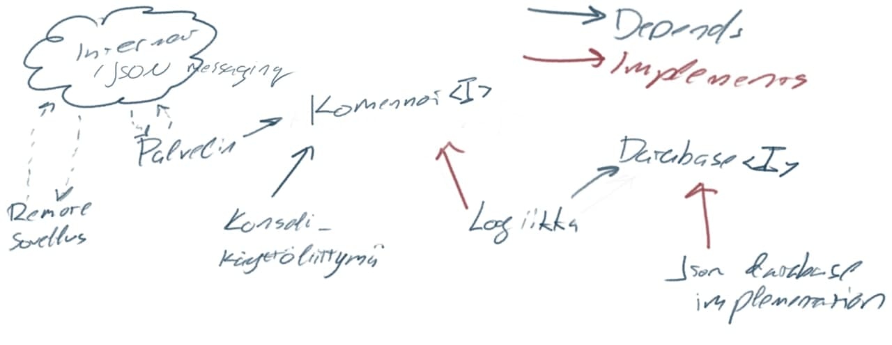

# Lukuvinkkikirjasto

[![Continuous Integration][ci-img]][ci-url]
[![Coverage Status][coverage-img]][coverage-url]

Product backlog:
<https://docs.google.com/spreadsheets/d/1zUi1pc9pQ-kz11Bn88Q34mbKgrZqrk1Bsj93MvS5I70/edit#gid=1>

Miniprojektin ohjeet: <https://ohjelmistotuotanto-hy-avoin.github.io/miniprojekti/>

Aiheen kuvaus: <https://ohjelmistotuotanto-hy-avoin.github.io/speksi/>

## Arkkitehtuuri



## Definition of done

- User storylle on määritelty hyväksymiskriteerit.
- User story on jaettu teknisen tason työtehtäviksi.
- Automatisoidut yksikkötestit on tehty.
- Automatisoidut hyväksymistestit on tehty.
- Testien rivikattavuus on vähintään 80 %.
- Ohjelmakoodi on selkeää ja läpäisee automaattisen checkstyle-testin.
- Ei-triviaalit muutokset ohjelmakoodiin on katselmoitu jonkun muun kuin
  ohjelmakoodin kirjoittajan toimesta.

## Asennus- ja käyttöohje

Ohjelman riippuvuuksien asennus ja ohjelman suoritus tapahtuu gradlella:

```bash
./gradlew run --console=plain
```

Ohjelmassa on tekstikäyttöliittymä. Kun ohjelman käynnistää, se listaa eri komennot. Vaihtoehdot ovat

- `add`
- `list`
- `quit`

### Vinkin lisääminen

Vinkin lisääminen tapahtuu kirjoittamalla `add`. Tämän jälkeen ohjelma kysyy ensin vinkin otsikon jonka jälkeen vinkin url-osoitteen.

### Vinkkien listaaminen

Vinkkien listaaminen tapahtuu kirjoittamalla `list`. Tuloste on (esimerkiksi)

```text
Id: 1
Otsikko: Merge sort algorithm
Url: https://www.youtube.com/watch?v=TzeBrDU-JaY


Id: 2
Otsikko: Consistency models
Url: https://dev.to/napicellatwit/consistency-models-52l
```

### Vinkkien poistaminen

Vinkkien poistaminen tapahtuu kirjoittamalla `remove`. Ohjelma listaa
tietokannassa olevat lukuvinkit. Tämän jälkeen valitaan sen lukuvinkin id-numero
joka halutaan poistaa ja varmistuksen jälkeen vinkki poistuu tietokannasta.

```text
remove
  1 Merge sort algorithm
  2 Consistency models
Valitse id-numero:
1
Poistetaanko vinkki id-numerolla 1 ja otsikolla 'Merge sort algorithm'? [k/e]
k
Vinkki 1 poistettu!
```

### Ohjelmasta poistuminen

Ohjelmasta poistuminen tapahtuu kirjoittamalla `quit`.

[ci-img]: https://github.com/ahojukka5/lukuvinkkikirjasto/actions/workflows/gradle.yml/badge.svg
[ci-url]: https://github.com/ahojukka5/lukuvinkkikirjasto/actions?query=workflow%3ACI+branch%3Amaster
[coverage-img]: https://coveralls.io/repos/github/ahojukka5/lukuvinkkikirjasto/badge.svg?branch=master
[coverage-url]: https://coveralls.io/github/ahojukka5/lukuvinkkikirjasto?branch=master
